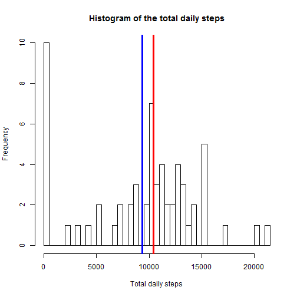
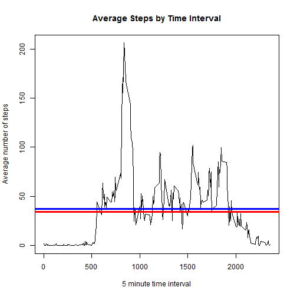
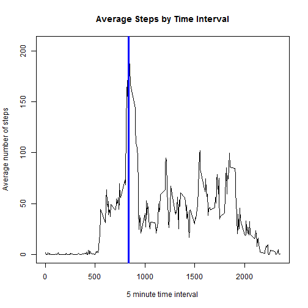
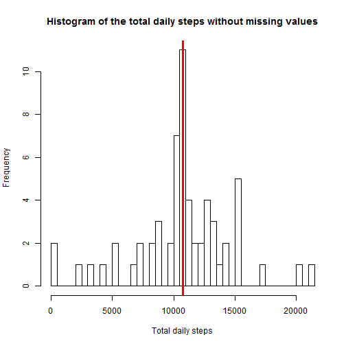
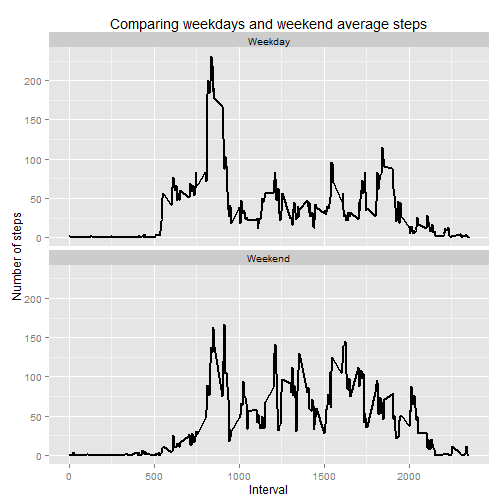
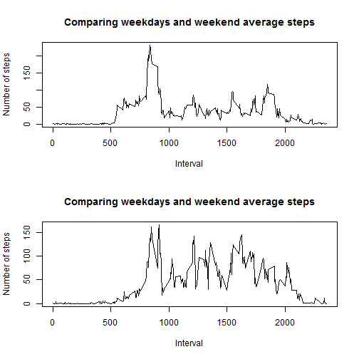

## Loading and preprocessing the data

Show any code that is needed to

1. Load the data (i.e. read.csv())

Before anything, we were asked to "always use echo = TRUE so that someone else will be able to read the code.". So let's start by loading the required libraries and setting the respective global option:


```r
library(knitr)
library(ggplot2)
opts_chunk$set(echo = TRUE)
```

Now to load the data. The required file was previouskly downloaded from https://d396qusza40orc.cloudfront.net/repdata%2Fdata%2Factivity.zip. The CSV file containing the data was extracted from the downloaded zip file and stored as 'activity.csv' on the same path as this R Markdown script.


```r
dtf.amd <- read.csv("activity.csv")
```

2. Process/transform the data (if necessary) into a format suitable for your analysis

The only processing necessary is to set the "date" column as a date object instead of factor.

```r
str(dtf.amd)
```

```
## 'data.frame':	17568 obs. of  3 variables:
##  $ steps   : int  NA NA NA NA NA NA NA NA NA NA ...
##  $ date    : Factor w/ 61 levels "2012-10-01","2012-10-02",..: 1 1 1 1 1 1 1 1 1 1 ...
##  $ interval: int  0 5 10 15 20 25 30 35 40 45 ...
```

```r
dtf.amd$date <- as.Date(dtf.amd$date)
str(dtf.amd)
```

```
## 'data.frame':	17568 obs. of  3 variables:
##  $ steps   : int  NA NA NA NA NA NA NA NA NA NA ...
##  $ date    : Date, format: "2012-10-01" "2012-10-01" ...
##  $ interval: int  0 5 10 15 20 25 30 35 40 45 ...
```

Let's take a look at the data that we're going to work with:


```r
head(dtf.amd)
```

```
##   steps       date interval
## 1    NA 2012-10-01        0
## 2    NA 2012-10-01        5
## 3    NA 2012-10-01       10
## 4    NA 2012-10-01       15
## 5    NA 2012-10-01       20
## 6    NA 2012-10-01       25
```

```r
summary(dtf.amd)
```

```
##      steps             date               interval     
##  Min.   :  0.00   Min.   :2012-10-01   Min.   :   0.0  
##  1st Qu.:  0.00   1st Qu.:2012-10-16   1st Qu.: 588.8  
##  Median :  0.00   Median :2012-10-31   Median :1177.5  
##  Mean   : 37.38   Mean   :2012-10-31   Mean   :1177.5  
##  3rd Qu.: 12.00   3rd Qu.:2012-11-15   3rd Qu.:1766.2  
##  Max.   :806.00   Max.   :2012-11-30   Max.   :2355.0  
##  NA's   :2304
```

## What is mean total number of steps taken per day?

For this part of the assignment, you can ignore the missing values in the dataset.

### 1. Calculate the total number of steps taken per day

To answer this, we first to need a data frame with the number of steps done each day and that's why we're building this new data frame 'dtf.daily.total' where we sum the steps by date:


```r
        dtf.daily.total <- aggregate(dtf.amd$steps,
                                     by=list((dtf.amd$date)),
                                     sum,
                                     na.rm=TRUE)
        names(dtf.daily.total) <- c("date", "steps")
```

### 2. If you do not understand the difference between a histogram and a barplot, research the difference between them. Make a histogram of the total number of steps taken each day

The histogrram is better shown increasing the number of bins to 50 bins but it can be done with Sturges, Scott and Freedman-Diaconis automatically, just use $breaks="Sturges"$ instead of $breaks=50$ in the code below. All those provide 5 bins.

The mean (in blue) and median (in red) are also ploted to help visualize:


```r
        hist(dtf.daily.total$steps, 
             main="Histogram of the total daily steps",
             xlab="Total daily steps",
             breaks=50
             )
        abline(v=mean(dtf.daily.total$steps), lwd=3, col="blue")
        abline(v=median(dtf.daily.total$steps), lwd=3, col="red")
```

 

### 3. Calculate and report the mean and median of the total number of steps taken per day

We can compute explicitly the mean and the median, respectively, of the daily steps:

```r
        mean(dtf.daily.total$steps)
```

```
## [1] 9354.23
```

```r
        median(dtf.daily.total$steps)
```

```
## [1] 10395
```

But we could also reach that by simple inspection of the new data frame with the summary function:


```r
summary(dtf.daily.total)
```

```
##       date                steps      
##  Min.   :2012-10-01   Min.   :    0  
##  1st Qu.:2012-10-16   1st Qu.: 6778  
##  Median :2012-10-31   Median :10395  
##  Mean   :2012-10-31   Mean   : 9354  
##  3rd Qu.:2012-11-15   3rd Qu.:12811  
##  Max.   :2012-11-30   Max.   :21194
```


## What is the average daily activity pattern?

### 1. Make a time series plot (i.e. type = "l") of the 5-minute interval (x-axis) and the average number of steps taken, averaged across all days (y-axis)

We need to a new data frame 'dtf.steps.by.interval' that we can plot as requested:


```r
        dtf.steps.by.interval  <- aggregate(dtf.amd$steps,
                                            by=list(dtf.amd$interval),
                                            FUN=mean,
                                            na.rm=TRUE)
        names(dtf.steps.by.interval) <- c("interval","steps")
        plot(dtf.steps.by.interval$interval,
             dtf.steps.by.interval$steps,
             type = "l",
             main = "Average Steps by Time Interval",
             xlab = "5 minute time interval",
             ylab = "Average number of steps")
        mean <- mean(dtf.steps.by.interval$steps)
        median <- median(dtf.steps.by.interval$steps)
        abline(h=mean, lwd=3, col="blue")
        abline(h=median, lwd=3, col="red")
```

 

```r
        mean
```

```
## [1] 37.3826
```

```r
        median
```

```
## [1] 34.11321
```

### 2. Which 5-minute interval, on average across all the days in the dataset, contains the maximum number of steps?

We can compute directly what is the maximum number of steps and then find the intervals where they occured:

```r
        max <- max(dtf.steps.by.interval$steps)
        interval <- dtf.steps.by.interval$interval[dtf.steps.by.interval$steps==max]
        interval
```

```
## [1] 835
```
And then we can add the information to the plot. The max value is 206 and it's reached on interval 835.


```r
        plot(dtf.steps.by.interval$interval,
             dtf.steps.by.interval$steps,
             type = "l",
             main = "Average Steps by Time Interval",
             xlab = "5 minute time interval",
             ylab = "Average number of steps")
        abline(v=interval, lwd=3, col="blue")
```

 

## Imputing missing values

Note that there are a number of days/intervals where there are missing values (coded as NA). The presence of missing days may introduce bias into some calculations or summaries of the data.

### 1. Calculate and report the total number of missing values in the dataset (i.e. the total number of rows with NAs)

The total number of rows missing values in the original dataset can be calculated as follows:

```r
        sum(is.na(dtf.amd$steps))
```

```
## [1] 2304
```
### 2. Devise a strategy for filling in all of the missing values in the dataset. The strategy does not need to be sophisticated. For example, you could use the mean/median for that day, or the mean for that 5-minute interval, etc.

Both the mean/median of the day and the mean of the 5-minute interval have some problems that both are better approximation than keeping the missing values.

In the end I opted for the mean of the 5-minute interval.

### 3. Create a new dataset that is equal to the original dataset but with the missing data filled in.
Let's start by creating an index to the problem roes, the ones with missing values on the "steps" column:

```r
        na.index <- is.na(dtf.amd$steps)
        dtf.amd.calculated <- dtf.amd
        dtf.amd.calculated[na.index,]$steps <- dtf.steps.by.interval$steps
        head(dtf.amd.calculated)
```

```
##       steps       date interval
## 1 1.7169811 2012-10-01        0
## 2 0.3396226 2012-10-01        5
## 3 0.1320755 2012-10-01       10
## 4 0.1509434 2012-10-01       15
## 5 0.0754717 2012-10-01       20
## 6 2.0943396 2012-10-01       25
```

Just to make sure, we can double check if the calculation is right by inspecting, for instance, the value for interval 5 on day 2012-10-01 (which is on the report, in the begining, listed as NA)

```r
        mean(dtf.steps.by.interval$steps[dtf.steps.by.interval$interval == 5])
```

```
## [1] 0.3396226
```

### 4. Make a histogram of the total number of steps taken each day and Calculate and report the mean and median total number of steps taken per day. Do these values differ from the estimates from the first part of the assignment? What is the impact of imputing missing data on the estimates of the total daily number of steps?

```r
        dtf.daily.total.calculated <- aggregate(dtf.amd.calculated$steps,
                                     by=list((dtf.amd.calculated$date)),
                                     sum)
        names(dtf.daily.total.calculated) <- c("date", "steps")
        hist(dtf.daily.total.calculated$steps, 
             main="Histogram of the total daily steps without missing values",
             xlab="Total daily steps",
             breaks=50
             )
        mean <- mean(dtf.daily.total.calculated$steps)
        median <- median(dtf.daily.total.calculated$steps)
        abline(v=mean, lwd=3, col="blue")
        abline(v=median, lwd=3, col="red")
```

 

```r
        mean
```

```
## [1] 10766.19
```

```r
        median
```

```
## [1] 10766.19
```
Now the mean is the same as the median (by construction) and the value is greater than before. The mean was 9354.2295082 and the median was 10395 and now they're both 1.0766189 &times; 10<sup>4</sup>.

## Are there differences in activity patterns between weekdays and weekends?

For this part the weekdays() function may be of some help here. Use the dataset with the filled-in missing values for this part.

### 1. Create a new factor variable in the dataset with two levels - "weekday" and "weekend" indicating whether a given date is a weekday or weekend day.

We first add a new column "weekday" to the data frame 'dtf.amd.calculated' with the name of the day of the week for the respective date. Then we add a second column 'dayorend' with the text 'Weekday' or 'Weekend' accordingly to the text in the weekday column (this text is in Portuguese).

Finnaly, we take a look at the first rows of data and its content types with the $head$ and $text$ functions.

```r
        dtf.amd.calculated$weekday <- weekdays(dtf.amd.calculated$date)
        dtf.amd.calculated$weekday <- factor(dtf.amd.calculated$weekday)
        dtf.amd.calculated$dayorend <- as.factor(ifelse(dtf.amd.calculated$weekday %in% c("sábado","domingo"), "Weekend", "Weekday")) 
        head(dtf.amd.calculated)
```

```
##       steps       date interval       weekday dayorend
## 1 1.7169811 2012-10-01        0 segunda-feira  Weekday
## 2 0.3396226 2012-10-01        5 segunda-feira  Weekday
## 3 0.1320755 2012-10-01       10 segunda-feira  Weekday
## 4 0.1509434 2012-10-01       15 segunda-feira  Weekday
## 5 0.0754717 2012-10-01       20 segunda-feira  Weekday
## 6 2.0943396 2012-10-01       25 segunda-feira  Weekday
```

```r
        str(dtf.amd.calculated)
```

```
## 'data.frame':	17568 obs. of  5 variables:
##  $ steps   : num  1.717 0.3396 0.1321 0.1509 0.0755 ...
##  $ date    : Date, format: "2012-10-01" "2012-10-01" ...
##  $ interval: int  0 5 10 15 20 25 30 35 40 45 ...
##  $ weekday : Factor w/ 7 levels "domingo","quarta-feira",..: 5 5 5 5 5 5 5 5 5 5 ...
##  $ dayorend: Factor w/ 2 levels "Weekday","Weekend": 1 1 1 1 1 1 1 1 1 1 ...
```

### 2. Make a panel plot containing a time series plot (i.e. type = "l") of the 5-minute interval (x-axis) and the average number of steps taken, averaged across all weekday days or weekend days (y-axis). See the README file in the GitHub repository to see an example of what this plot should look like using simulated data.

We could use the base plotting system to do this, but it's much easier and appealing using ggplot.

```r
        plot.data  <- aggregate(dtf.amd.calculated$steps,
                                by = list(dtf.amd.calculated$interval,
                                          dtf.amd.calculated$dayorend),
                                FUN = mean,
                                na.rm=TRUE)
        names(plot.data) <- c("interval","weekday.or.end","steps")
        time.series.panel <- ggplot(plot.data,aes(interval, steps)) +
                ggtitle("Comparing weekdays and weekend average steps") +
                facet_wrap(~weekday.or.end, ncol=1) +
                xlab("Interval") +
                ylab("Number of steps") +
                geom_line(size = 1)
        time.series.panel 
```

 

Nevertheless I included the code to do the same using base plot system, just for reference.


```r
        plot.data  <- aggregate(dtf.amd.calculated$steps,
                                by = list(dtf.amd.calculated$interval,
                                          dtf.amd.calculated$dayorend),
                                FUN = mean,
                                na.rm=TRUE)
        names(plot.data) <- c("interval","weekday.or.end","steps")
        par(mfrow=c(2,1))
        plot(plot.data$interval[plot.data$weekday.or.end == "Weekday"],
             plot.data$steps[plot.data$weekday.or.end == "Weekday"],
             type = "l",
             main = "Comparing weekdays and weekend average steps",
             xlab = "Interval",
             ylab = "Number of steps")
        plot(plot.data$interval[plot.data$weekday.or.end == "Weekend"],
             plot.data$steps[plot.data$weekday.or.end == "Weekend"],
             type = "l",
             main = "Comparing weekdays and weekend average steps",
             xlab = "Interval",
             ylab = "Number of steps")
```

 
